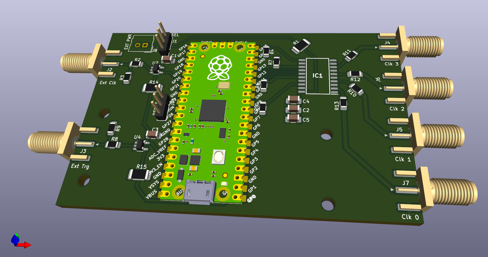
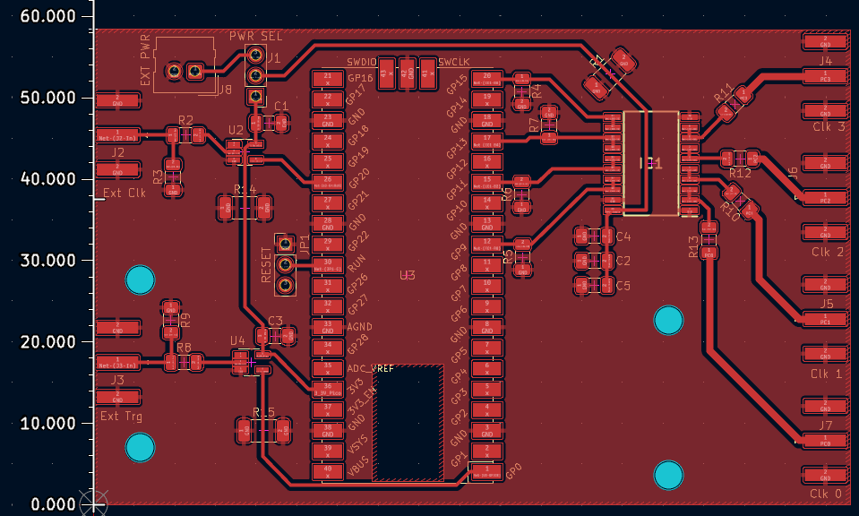
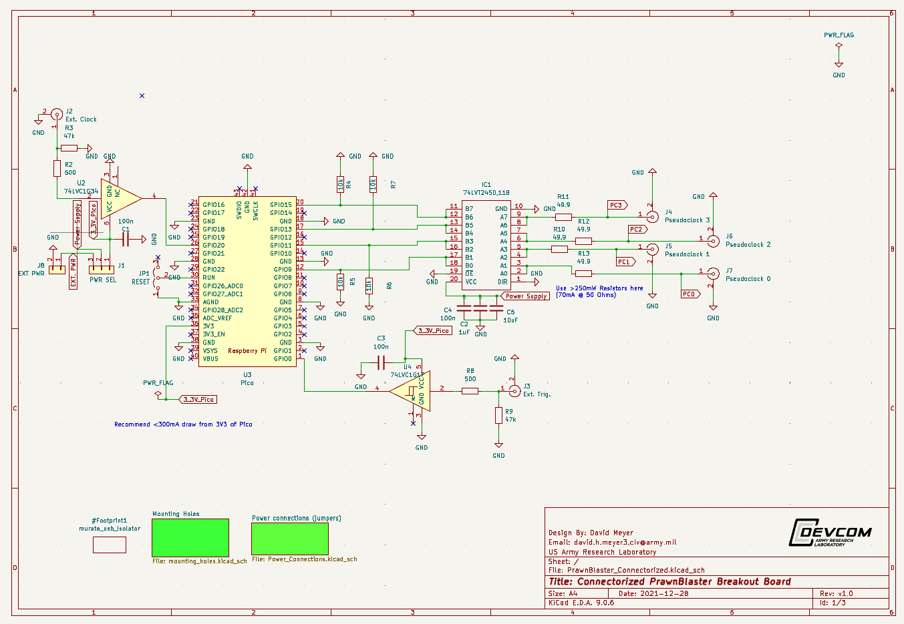

# PrawnBlaster_Breakout_Connectorized

This is a KiCAD (v7) project design for a breakout board for the [PrawnBlaster][1],
a pseudo-clock generation device used in the [labscript-suite][2].
The PrawnBlaster is a custom firmware for the Rasperry Pi Pico microcontroller board.

This board is highly inspired by the [PrawnBlaster_Breakout][3] board;
it's inspiration being to make a connectorized version that can be used
in a more stand-alone capacity.

This breakout board employs a surface mount footprint to attach the Pico
as well as SMD IC and passive components,
provides SMA connectorized inputs and outputs,
buffering ICs at the inputs and outputs,
and is designed such that all power is drawn from the Pico's power supply.

SMD passive components are no smaller than 0805 to facilitate hand soldering.

## Screenshots
The following screenshots are taken from Kicad

Note: Scale on left is in mm. PCB is about 58 x 93mm.

## Fabrication

The designs in the `KiCAD\gerbers` subdirectory were made to be printed using a Bantham Tools CNC/PCB router.
They include only the front-side copper and edge-cuts layers with a drill hole file.
For best results, use a single-sided FR1 board with a 1/100, 1/64 and 1/32 End-Mills.

To get outputs for a fabricator, regenerate the gerber files using the fabricators desired export settings.

## Input/Output Buffers

The PrawnBlaster's clock input is buffered using a 74LVC1G34 unity-gain buffer,
which provides compatibility with 5VTTL clock inputs.
The PrawnBlaster's trigger input is buffered using a 74LVC1G17 buffer Schmitt-trigger,
which provides compatibility with 5VTTL logic and handles slow rising edge trigger signals.
The PrawnBlaster's four outputs are buffered using a 74LVT245D octal transceiver,
configured to drive in only the output direction.
Each PrawnBlaster output drives two inputs of the buffer to double the current source/sink
capabilities of each line-driving output.

## Power Considerations

It is recommended to use USB data/power isolation to power the Pico to ensure
the PrawnBlaster grounds are not tied to the controlling computer grounds while providing sufficient current for all devices.
We use the NMUSBEVALEXC dual USB port eval board from Murata as it can provide sufficient currents.

[1]: https://github.com/labscript-suite/PrawnBlaster
[2]: https://docs.labscriptsuite.org/en/latest/
[3]: https://github.com/TU-Darmstadt-APQ/Prawnblaster-Breakout
